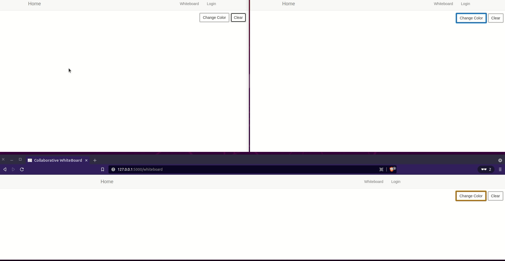

# Virtual Whiteboard

This is a blank digital space where multiple people can collaborate (write, share and interact) in real-time. Some of the common uses of a whiteboard are brainstorming, problem-solving and visualizing ideas.



## Features

- Browser synchronization
- Real-time collaboration
- Mobile support

### Tools Used

- Flask
- Python 
- Twilio Sync

## Deployment

- [Pamoja whiteboard](https://pamoja-whiteboard.herokuapp.com/) on Heroku

## Notes

This is a work in progress. The project is at its early stages. I intend to add more features and improve the UI over time. Some of the ideas I am thinking to incorporate are:

- User authentication
- Synchornization of the clear button
- Reduce latency between users who type fast

## Reference

There are a couple of other whiteboard projects, with more features that I am currently looking into. Some of them are:

- [Collab whiteboard by faridelaouadi](https://github.com/faridelaouadi/online-whiteboard)
- [Collab whiteboard by exaphis](https://github.com/Exaphis/collab-whiteboard)

## Test The Application

Meanwhile, you can run the application locally. Run the commands below to start the application.:

1. Clone this repository:
    ```python
    git clone git@github.com:GitauHarrison/collaborative-whiteboard-using-flask-and-twilio-sync.git
    ```

2. Change directory to the repository:
    ```python
    cd collaborative-whiteboard-using-flask-and-twilio-sync
    ```

3. Create and activate a virtual environment:
    ```python
    $ virtualenv venv
    $ source venv/bin/activate

    # Alternatively, you can use virtualenvwrapper
    $ mkvirtualenv venv
    ```
    - Virtualenvwrapper is a wrapper around virtualenv that makes it easier to use virtualenvs. mkvirtualenv not only creates but also activates a virtual enviroment for you. Learn more about virtualenvwrapper [here](https://github.com/GitauHarrison/notes/blob/master/virtualenvwrapper_setup.md).

4. Install dependencies:
    ```python
    (venv)$ pip3 install -r requirements.txt
    ```

5. Update environment variables:
    ```python
    (venv) cp .env.example .env
    # Ensure that the .env file is in the root of the project
    ```

6. Run the application:
    ```python
    (venv)$ flask run
    ```

7. Open the browser and navigate to http://localhost:5000/. You should see the application running.

8. Click on the _whiteboard_ link in the URL bar. You should see the whiteboard.

9. Paste the same _whiteboard_ link on another browser window to test collaborative features.

10. Try to write something on the whiteboard. You should see the text appear on the other browser window.

_You can also run the application on your mobile devices_.